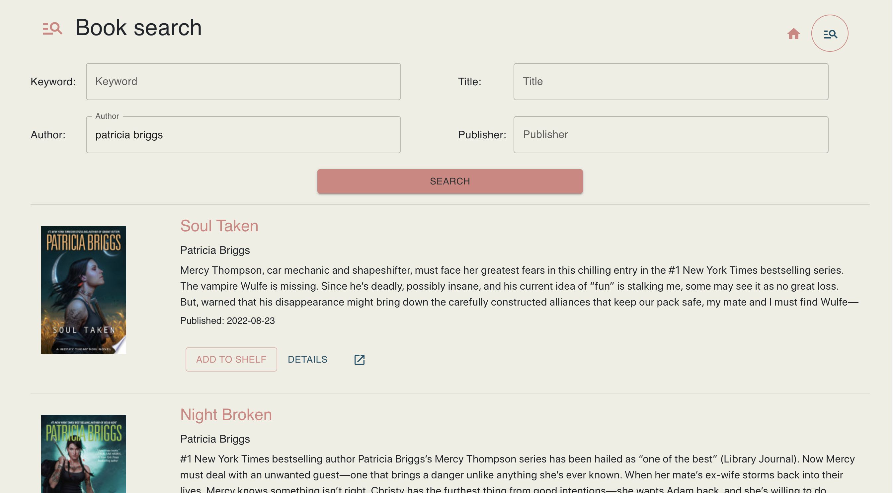
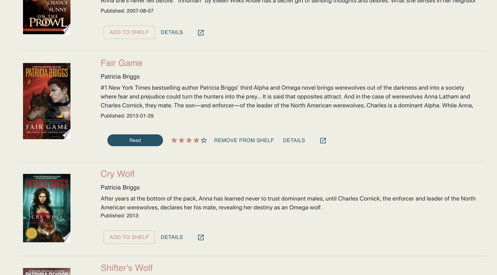
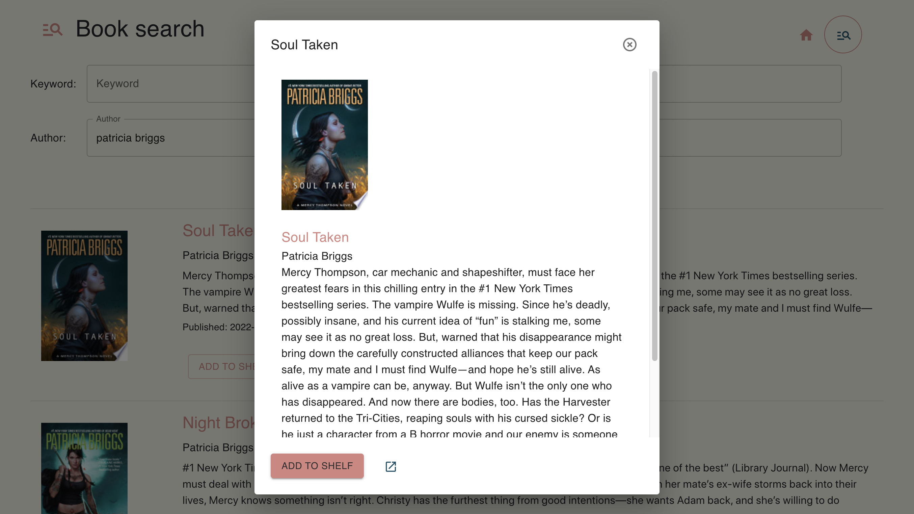
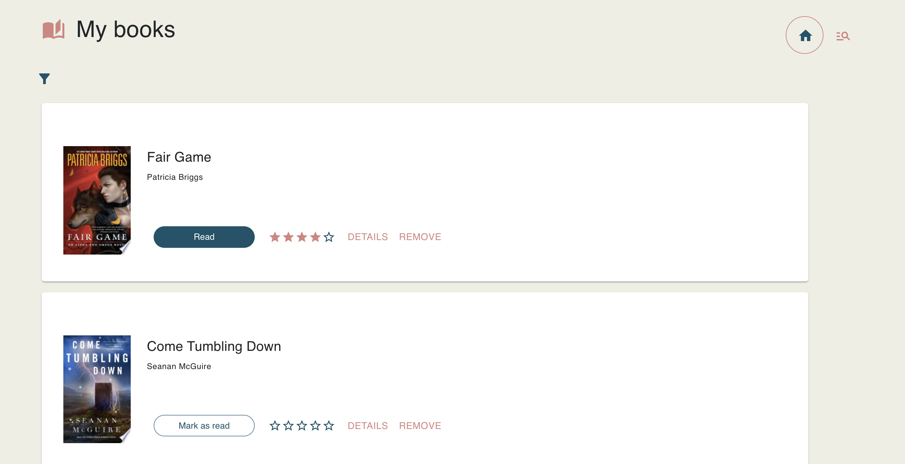
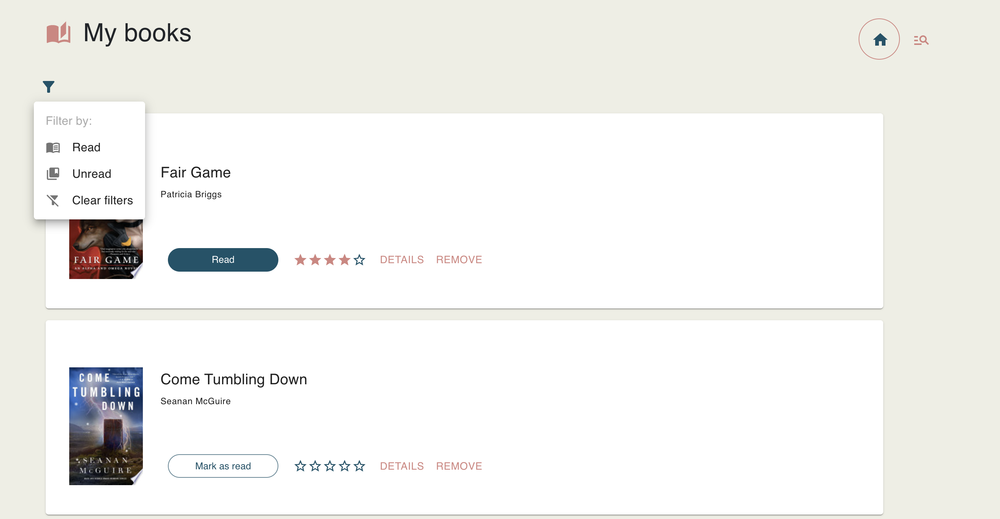
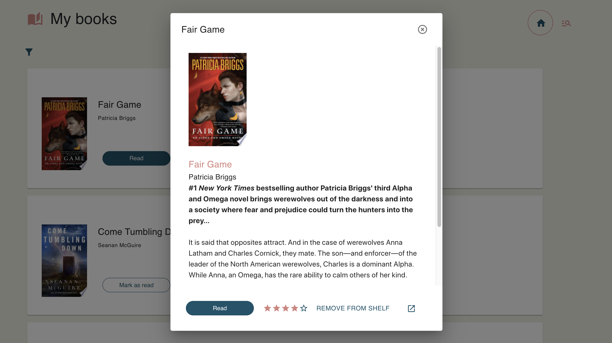

# My bookshelf

> A personal bookshelf powered by Google Books API.
> A user can create an account, save books to their private shelf, mark them as read or unread, filter, and rate their favorite books! User preferences and books are saved in a postgres database through the Ruby on Rails API backend (see below for details).

After logging in the user is directed to their bookshelf. If no books are yet saved, they are met with a prompt and a link to the search page. Upon searching, the user is presented with a list of books matching the query (limit 10) with a handy-dandy link to add the book to your shelf, or view the page on the web (external link).

If a book in the search results is already in the user's bookshelf, data for the book (status, rating, etc.) is also shown on the search results page. Books can be added, rated, marked as read, and removed from the user's bookshelf directly on this page.

Clicking on "Details" opens a Details Dialog with the full description of the book as well as available actions.

Once the user has books saved to their bookshelf, they will be displayed on the bookshelf (manage) page.

With the ability to filter by read or unread items.

The books displayed on the bookshelf are only summaries, with the title, author, image and user data. But clicking the "Details" button will again open the Details Dialog showcasing the full book details.

## Local development

For local development you must also run the Ruby on Rails API located at <a href="https://github.com/liztownd/books_on_rails">https://github.com/liztownd/books_on_rails</a>. Follow the instructions in that README to run locally.

After installing dependencies, run `npm start` and navigate to <a href="http://localhost:4000/mybookshelf">http://localhost:400/mybookshelf0</a> to view the app.

## Deployment

The API is deployed to Heroku. The deployed UI is available at <a href="https://liztownd.github.io/mybookshelf">https://liztownd.github.io/mybookshelf</a>.
